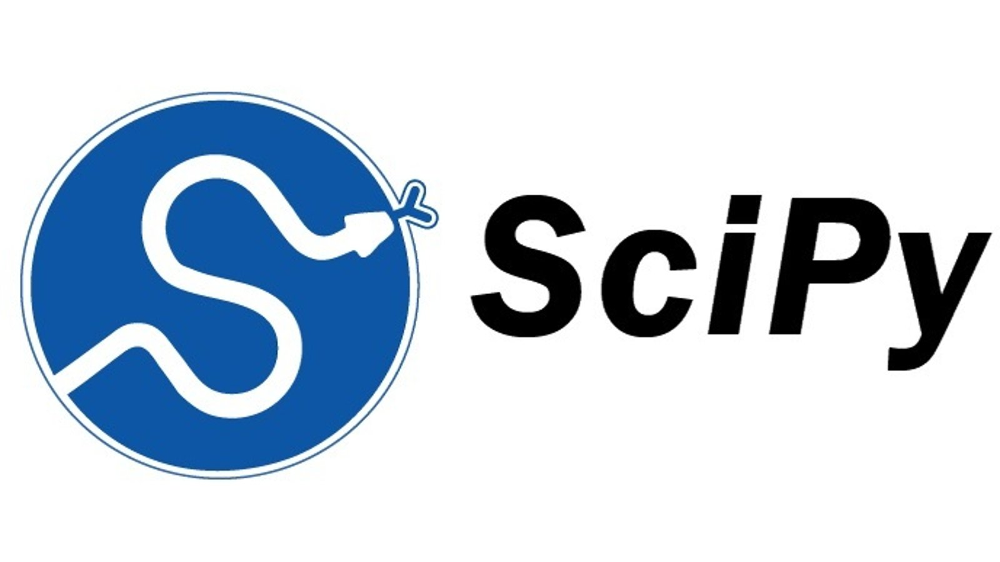
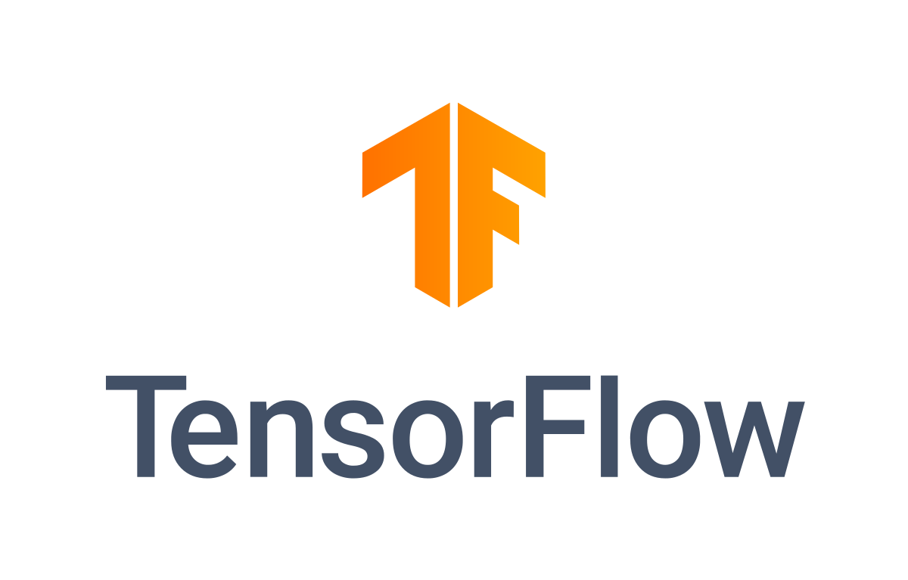

#  Scientific Computing for Mechanical Engineering
##  Object-Oriented Programming

---
src: ./slides/intro.md
---

<!-- slides imported from intro.md -->

---
src: ./slides/toc.md
---

<!-- table of contents -->

---
layout: center
class: red-background
---

# Introduction to Python

---
src: ./slides/python.md
---

<!-- slides imported from python.md -->

---
layout: center
class: red-background
---

# Object-Oriented Programming (OOP)

---
src: ./slides/oop.md
---

<!-- slides imported from oop.md -->

---
layout: center
class: red-background
---

# Data Analysis using Python

---
layout: two-cols
---

## Popular Python libraries

<v-click>
- NumPy: Numerical computing with arrays.
</v-click>
 

<v-click>
- Pandas: Data manipulation and analysis.
</v-click>
 

<v-click>
- Matplotlib: 2D plotting and visualization.
</v-click>
 

<v-click>
- SciPy: Scientific and technical computing.
</v-click>
 

<v-click>
- Scikit-learn: Machine learning algorithms toolkit.
</v-click>
 

<v-click>
- TensorFlow: Deep learning framework by Google.
</v-click>
 

<v-click>
- Keras: High-level neural networks API.
</v-click>
 

<v-click>
- PyTorch: Deep learning library by Meta.
</v-click>
 

<v-click>
- Flask: Lightweight web application framework.
</v-click>

::right::

&nbsp;

  

  

  

  

  

  

  

  

  

<!-- add snipped of the different libraries -->

---
layout: default
---

## Introduction of the problem to be considered

    

        <iframe src="https://ourworldindata.org/explorers/energy?time=2023&hideControls=false&Total+or+Breakdown=Select+a+source&Energy+or+Electricity=Primary+energy&Metric=Per+capita+consumption&Select+a+source=Renewables&country=USA~GBR~CHN~OWID_WRL~IND~BRA~ZAF&tab=map" loading="lazy" style="width: 100%; height: 600px; border: 0px none;" allow="web-share; clipboard-write"></iframe>
    

---

## Introduction of the problem to be considered

- Data analysis using Pandas: 
    - What does the data set look like?
    - How can we alter the dataset?

- Data plotting with MatplotLib 
    - How can we visualize the data set?
    - Can we find a curve fit?

- NumPy foundation
    - How does the mathematical framework behind o.a. Pandas work?

---
layout: center
class: red-background
---

# Pandas - Python Data Analysis Library

---
src: ./slides/data.md
---

<!-- slides imported from pandas.md -->

---
layout: center
class: red-background
---

# MatplotLib - Python Plotting Library

---
src: ./slides/plots.md
---

<!-- slides imported from plots.md -->

---
layout: center
class: red-background
---

# NumPy - Python Linear Algebra Library

---
src: ./slides/numpy.md
---

<!-- slides imported from numpy.md -->

---
layout: center
class: red-background
---

# VSCode

---

## Getting started with Python and VSCode

- link to tutorial
- tips

---

## Whats next?

- Self-study session
    - Continue to work on first assignment
    - Python and VSCode installation
    - Instruction set
- Next lecture
    - Creating objects
    - Introduction to Assignment II: Evolutionary algorithm
